- [LeetCode solution new notes](#leetcode-solution-new-notes)
  - [@119@ Pascal triangle:](#119-pascal-triangle)
  - [@260 Single number III:](#260-single-number-iii)
  - [@258 Add digits:](#258-add-digits)
  - [@163 Missing range](#163-missing-range)
  - [@45 Jump Game](#45-jump-game)
  - [@189 Rotate array by k](#189-rotate-array-by-k)
  - [@91 Decode ways:](#91-decode-ways)
  - [@98 Valid BST](#98-valid-bst)
  - [@105 BuildBTViaInorderPreorder](#105-buildbtviainorderpreorder)
  - [@106 BuildBTViaInorderPostorder](#106-buildbtviainorderpostorder)
  - [@309 Buy and sell stock with cooldown](#309-buy-and-sell-stock-with-cooldown)
#  LeetCode solution new notes
<!--  -->
[//]: <another comment>
<!-------- comment here, sample -->

## @119@ Pascal triangle:
>Brutal force big O:   

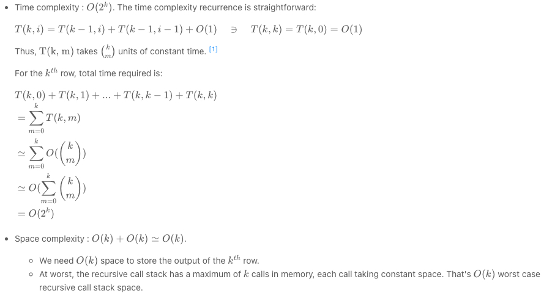

>Brutal force code: 

```java
private int getNum(int row, int col) {
    if (row == 0 || col == 0 || row == col) {
      return 1;
    }

    return getNum(row - 1, col - 1) + getNum(row - 1, col);
  }

  public List<Integer> getRow(int rowIndex) {
    List<Integer> ans = new ArrayList<>();

    for (int i = 0; i <= rowIndex; i++) {
      ans.add(getNum(rowIndex, i));
    }

    return ans;
  }
``` 

Explain: 
so for $k$ row, in the loop `for(int i = 0; i <= rowIndex; i++)`, you need to do $k=0-> rownIdx$, that will be:
$$T(k, 0) + T(k, 1) + T(k, 2) + ..+ T(k, k-1) + T(k, k)$$
And each of $T(k,i)$ will compute with 2 items:
$$T(k, i) = T(k-1, i-1) + T(k-1, i)$$
so it will be $T(k-1,i)$ and $T(k-1, i-1)$ will go down to $T(k-2,)$, there are $k$ calls to recursive function till $1$, so roughly it is $2^k$ 

## @260 Single number III:

1. x & -x keep the right most bit

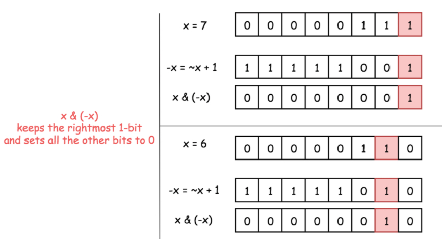

2. bitMaskForBoth

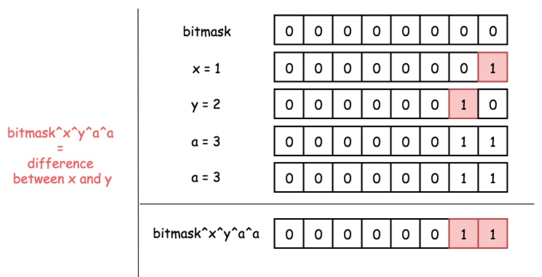

3. combined step 1 and 2. 

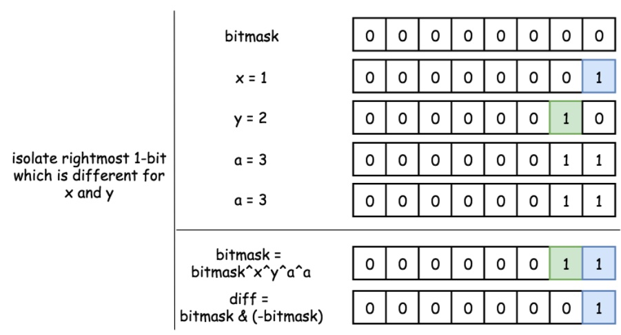

4. having these two will produce x and y, please check code:

```java
// bitmask which will contain only x, other repeated a will be off set by ^ Xor since it appears twice.
    for (int num : nums) if ((num & diffTeller) != 0) x ^= num;
    //now 
    y = bitmaskForBoth ^ x;
```
## @258 Add digits: 
>Math solution:

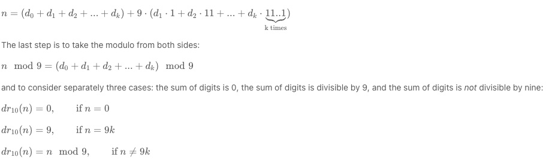

## @163 Missing range
> Normal and edge scenarios. one can use two pointers to advance 
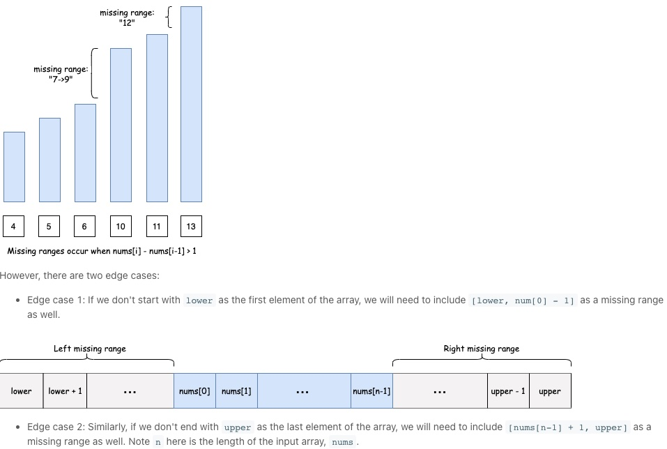

## @45 Jump Game
> Proof of greedy algo(local optimal) can lead to global optimal: keep updating local optimal.
Approach A will still lead to a better solution when differences happen at 3 and update happens after that.

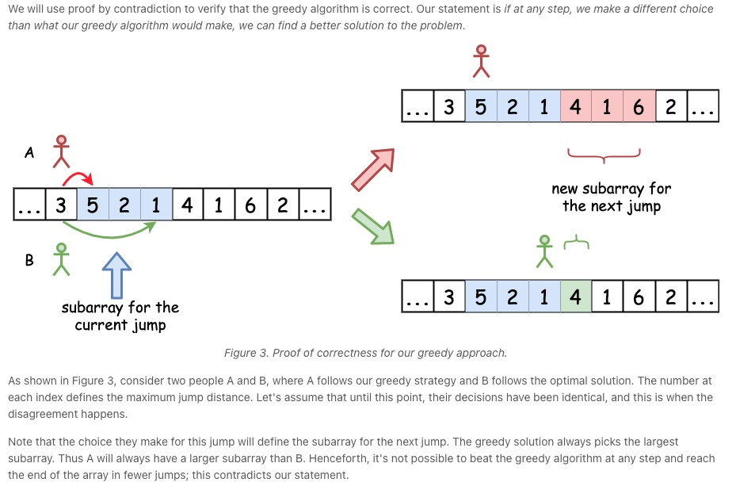

## @189 Rotate array by k

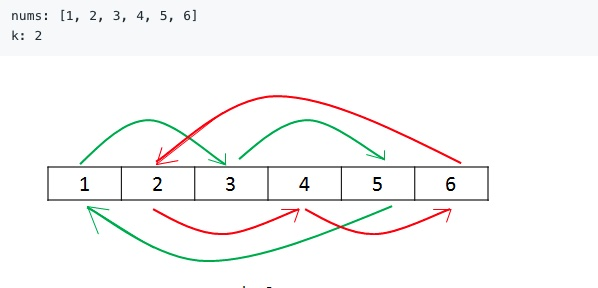

## @91 Decode ways:

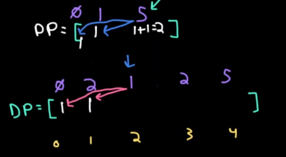

## @98 Valid BST

> Diagram for traveral orders for BT or BST, good to see.

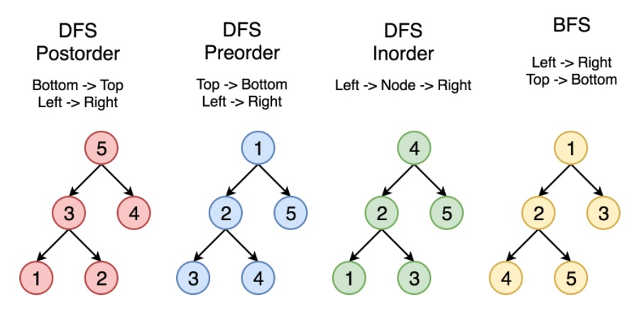

## @105 BuildBTViaInorderPreorder

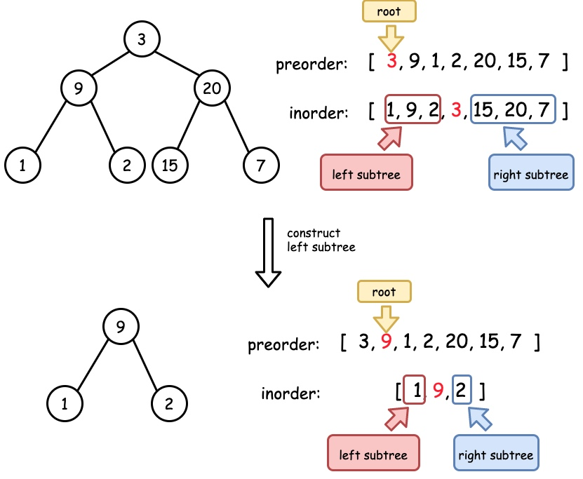


## @106 BuildBTViaInorderPostorder

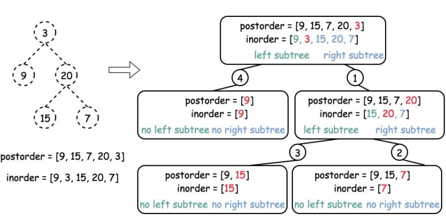

## @309 Buy and sell stock with cooldown
> sold[i]=hold[i−1]+price[i]

> held[i]=max(held[i−1],reset[i−1]−price[i])
 
> reset[i]=max(reset[i−1],sold[i−1])

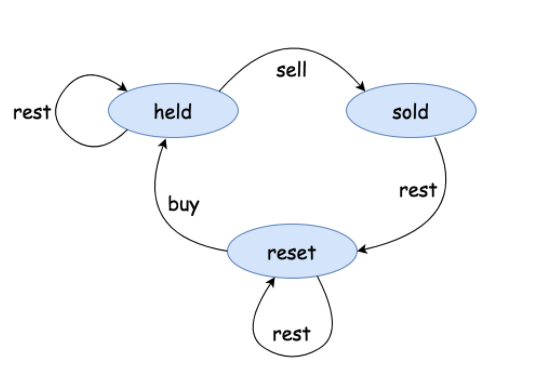
