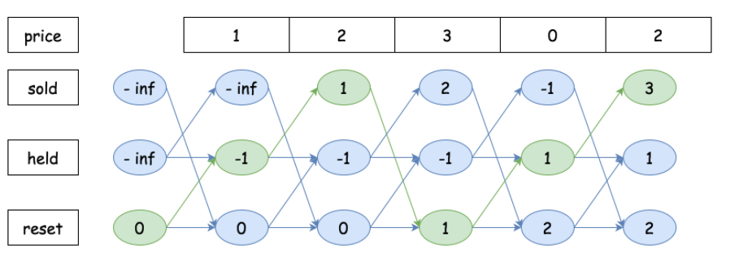
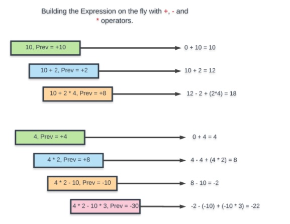

- [LeetCode solution new notes](#leetcode-solution-new-notes)
  - [@119@ Pascal triangle:](#119-pascal-triangle)
  - [@260 Single number III:](#260-single-number-iii)
  - [@258 Add digits:](#258-add-digits)
  - [@163 Missing range](#163-missing-range)
  - [@45 Jump Game](#45-jump-game)
  - [@189 Rotate array by k](#189-rotate-array-by-k)
  - [@91 Decode ways:](#91-decode-ways)
  - [@98 Valid BST](#98-valid-bst)
  - [@105 BuildBTViaInorderPreorder](#105-buildbtviainorderpreorder)
  - [@106 BuildBTViaInorderPostorder](#106-buildbtviainorderpostorder)
  - [@309 Buy and sell stock with cooldown](#309-buy-and-sell-stock-with-cooldown)
  - [@261 Valid tree by union find:](#261-valid-tree-by-union-find)
  - [@138 Copy Random list:](#138-copy-random-list)
  - [java collection cheat sheet:](#java-collection-cheat-sheet)
  - [interleaving string match](#interleaving-string-match)
  - [string to int, int to string, char to int, int to char, char array to String](#string-to-int-int-to-string-char-to-int-int-to-char-char-array-to-string)
  - [int[] to List.. check stackoverflow](#int-to-list-check-stackoverflow)
  - [how to choose the boundary of binary search](#how-to-choose-the-boundary-of-binary-search)
  - [@694 number of distinct islands](#694-number-of-distinct-islands)
  - [@65 valid number](#65-valid-number)
  - [@282  Add expressions](#282--add-expressions)
#  LeetCode solution new notes
<!--  -->
[//]: <another comment>
<!-------- comment here, sample -->

## @119@ Pascal triangle:
>Brutal force big O:   


>Brutal force code: 

```java
private int getNum(int row, int col) {
    if (row == 0 || col == 0 || row == col) {
      return 1;
    }

    return getNum(row - 1, col - 1) + getNum(row - 1, col);
  }

  public List<Integer> getRow(int rowIndex) {
    List<Integer> ans = new ArrayList<>();

    for (int i = 0; i <= rowIndex; i++) {
      ans.add(getNum(rowIndex, i));
    }

    return ans;
  }
``` 

Explain: 
so for $k$ row, in the loop `for(int i = 0; i <= rowIndex; i++)`, you need to do $k=0-> rownIdx$, that will be:
$$T(k, 0) + T(k, 1) + T(k, 2) + ..+ T(k, k-1) + T(k, k)$$
And each of $T(k,i)$ will compute with 2 items:
$$T(k, i) = T(k-1, i-1) + T(k-1, i)$$
so it will be $T(k-1,i)$ and $T(k-1, i-1)$ will go down to $T(k-2,)$, there are $k$ calls to recursive function till $1$, so roughly it is $2^k$ 

## @260 Single number III:

1. x & -x keep the right most bit


2. bitMaskForBoth


3. combined step 1 and 2. 


4. having these two will produce x and y, please check code:

```java
// bitmask which will contain only x, other repeated a will be off set by ^ Xor since it appears twice.
    for (int num : nums) if ((num & diffTeller) != 0) x ^= num;
    //now 
    y = bitmaskForBoth ^ x;
```
## @258 Add digits: 
>Math solution:


## @163 Missing range
> Normal and edge scenarios. one can use two pointers to advance 


## @45 Jump Game
> Proof of greedy algo(local optimal) can lead to global optimal: keep updating local optimal.
Approach A will still lead to a better solution when differences happen at 3 and update happens after that.


## @189 Rotate array by k


## @91 Decode ways:


## @98 Valid BST

> Diagram for traveral orders for BT or BST, good to see.


## @105 BuildBTViaInorderPreorder


## @106 BuildBTViaInorderPostorder


## @309 Buy and sell stock with cooldown
> sold[i]=hold[i−1]+price[i]

> held[i]=max(held[i−1],reset[i−1]−price[i])
 
> reset[i]=max(reset[i−1],sold[i−1])




## @261 Valid tree by union find:


## @138 Copy Random list:


## java collection cheat sheet:


## interleaving string match


## string to int, int to string, char to int, int to char, char array to String
> better use Integer or Character's built in function
```java
Integer.toString(num);
// res is a char[]
Integer.parseInt(String.valueOf(res));

//char to int, first might be better
Character.getNumericValue(aChar);
Integer.parseInt(String.valueOf(aChar))

//int to char
(char)(num + '0');
int REDIX=10;//redix 10 is for decimal number, for hexa use redix 16  
char c=Character.forDigit(num,REDIX)
```
## int[] to List.. check [stackoverflow](https://stackoverflow.com/questions/1073919/how-to-convert-int-into-listinteger-in-java)
> You can not use:
```java
List<Integer> list = Arrays.asList(int[]) 
//since int is not Integer type, fuxxk java 
//you should use
List<Integer> intList = Arrays.stream(weights).boxed().collect(Collectors.toList());
```
## how to choose the boundary of binary search
> How to assign values to l and r. It depends on the context!
https://medium.com/swlh/binary-search-find-upper-and-lower-bound-3f07867d81fb
```java
//either, most of the cases, searching for lower bound
//when even numbers, pick the former one of two numbers, also we want to make sure to avoid left = mid since it might have infinite loop, e.g. [0,1]
int mid = (left+right)/2; 
if(invalidCase)left = mid+1;  // coz we searching the lower bound
else right = mid;
//or, searching for the upper bound
//when even numbers, pick the latter one, also we want to make sure to avoid right = mid since it might have infinite loop, e.g. [0,1] 
int mid = (left+right+1)/2; 
if(invalidCase) right = mid-1; // coz we are searching the upper bound
else left = mid; 
```
* when  asks for the lower bound
  * if mid not work, l should be mid+1 because we are sure the mid is not the answer and everything falls one mid‘s left won’t work either
  * if mid works, then r should be mid not mid-1 because mid might be the answer!
* vice versa

## @694 number of distinct islands
>> pay attention to the '0'


## @65 valid number
>> s consists of only English letters (both uppercase and lowercase), digits (0-9), plus '+', minus '-', or dot '.', no space need to be considered(if need, just use str.trim())


## @282  Add expressions
>> to handle the *

